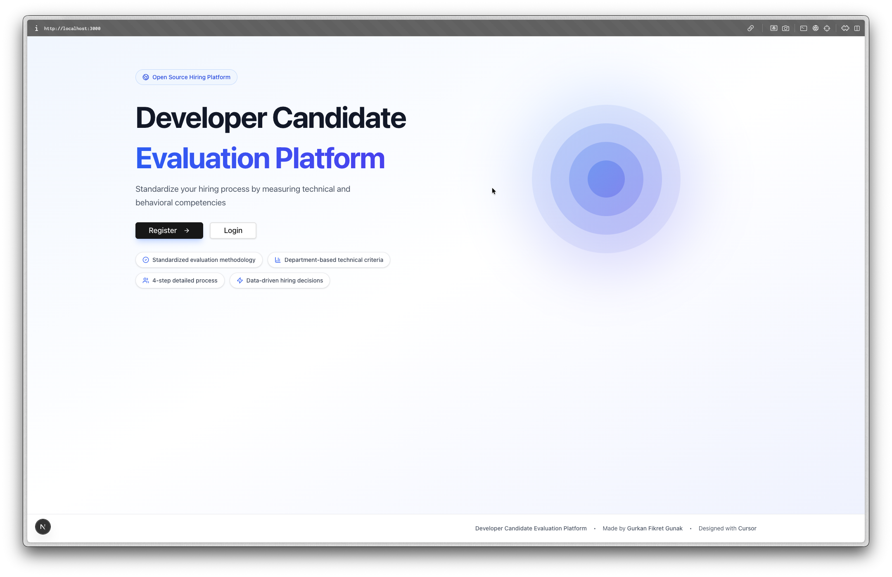

# Developer Candidate Evaluation Platform 🚀

> A modern, scalable, and open-source platform for standardizing technical hiring processes through objective, data-driven candidate evaluations.

[](https://nextjs.org/)
[](https://www.typescriptlang.org/)
[](https://supabase.com/)
[](LICENSE)

## 🌟 Overview

This platform revolutionizes your hiring process by providing a **structured 4-step evaluation framework** that measures both technical competencies and behavioral skills. Built with modern web technologies, it ensures consistency, objectivity, and data-driven decision-making across your entire recruitment pipeline.



### Key Benefits

- **🎯 Standardized Process** - Eliminate bias with structured evaluation criteria
- **📊 Data-Driven Decisions** - Automated scoring and comprehensive reporting
- **🔒 Secure & Private** - Organization-level data isolation with Row Level Security
- **🌍 Multi-Language Support** - English and Turkish with easy extensibility
- **📈 Real-Time Analytics** - Visual performance metrics and progress tracking
- **🎨 Modern UI/UX** - Intuitive interface with smooth animations

## ✨ Features

### 1. **Comprehensive Evaluation Workflow**

- **Step 1: General Information**
  - Candidate personal details
  - Position and department selection
  - CV upload and storage
  - Multiple evaluator assignment
  - Initial notes and impressions

- **Step 2: Technical Assessment**
  - Department-specific criteria (Backend, Frontend, Full Stack, DevOps, Mobile)
  - Customizable evaluation categories
  - 1-5 scoring scale with visual sliders
  - Automatic average calculation
  - Interactive performance charts

- **Step 3: Live Coding Evaluation**
  - 0-100 scoring system
  - Multi-dimensional assessment:
    - Code Quality
    - Problem Solving
    - Time Management
    - Communication
  - Solution URL tracking (GitHub, etc.)
  - Detailed coding session notes

- **Step 4: Final Decision**
  - Level assignment (Junior/Mid/Senior/Not Suitable)
  - Candidate status (Accepted/Rejected/Postponed/Pending)
  - Calculated overall score
  - Manual score override option
  - Comprehensive summary and recommendations

### 2. **Advanced Features**

- **📋 Markdown Reports**
  - Beautiful, exportable evaluation reports
  - Copy to clipboard or download as .md
  - Automatic formatting with emoji indicators
  - Score badges and progress visualization

- **🎨 Customizable Criteria**
  - Department-specific technical criteria
  - Organization-level customization
  - Default templates for all departments
  - Easy criteria management in settings

- **🔄 Real-Time Updates**
  - Instant data synchronization
  - Progress tracking across steps
  - Auto-save functionality

- **🌐 Internationalization (i18n)**
  - Full English and Turkish support
  - Easy to add new languages
  - Context-aware translations

## 🛠️ Tech Stack

### Frontend
- **[Next.js 16](https://nextjs.org/)** - React framework with App Router
- **[TypeScript](https://www.typescriptlang.org/)** - Type safety
- **[Tailwind CSS v4](https://tailwindcss.com/)** - Utility-first CSS
- **[shadcn/ui](https://ui.shadcn.com/)** - Beautiful UI components
- **[Framer Motion](https://www.framer.com/motion/)** - Smooth animations
- **[Recharts](https://recharts.org/)** - Data visualization
- **[React Three Fiber](https://docs.pmnd.rs/react-three-fiber/)** - 3D graphics
- **[next-intl](https://next-intl-docs.vercel.app/)** - Internationalization
- **[Zustand](https://github.com/pmndrs/zustand)** - State management
- **[React Hook Form](https://react-hook-form.com/)** - Form handling
- **[Zod](https://github.com/colinhacks/zod)** - Schema validation
- **[Sonner](https://sonner.emilkowal.ski/)** - Toast notifications
- **[Lucide Icons](https://lucide.dev/)** - Icon library
- **[date-fns](https://date-fns.org/)** - Date utilities

### Backend
- **[Supabase](https://supabase.com/)** - Backend as a Service
  - PostgreSQL database
  - Authentication & authorization
  - Row Level Security (RLS)
  - Storage for CV files
  - Real-time subscriptions

## 🚀 Quick Start

### Prerequisites

- Node.js 18+ and npm
- A [Supabase](https://supabase.com) account

### Installation

1. **Clone the repository**

```bash
git clone https://github.com/yourusername/developer-evaluation-platform.git
cd developer-evaluation-platform
```

2. **Install dependencies**

```bash
npm install
```

3. **Set up Supabase**

Create a new project on [Supabase](https://supabase.com) and get your credentials.

4. **Configure environment variables**

Create a `.env.local` file in the root directory:

```env
NEXT_PUBLIC_SUPABASE_URL=your-project-url.supabase.co
NEXT_PUBLIC_SUPABASE_ANON_KEY=your-anon-key
```

5. **Run database migrations**

In your Supabase SQL Editor, execute the following migrations in order:

```bash
supabase/migrations/001_initial_schema.sql
supabase/migrations/002_add_language.sql
supabase/migrations/003_add_cv_and_evaluators.sql
supabase/migrations/004_add_department_criteria.sql
```

**Optional:** Set up CV storage bucket (see `supabase/STORAGE_SETUP.md`)

6. **Start the development server**

```bash
npm run dev
```

Visit `http://localhost:3000` 🎉

## 📖 Usage Guide

### First-Time Setup

1. **Register an Account**
   - Navigate to the homepage
   - Click "Register" and create your account
   - You'll receive a confirmation email

2. **Create Your Organization**
   - On first login, you'll be prompted to create an organization
   - Enter your company name, sector, and preferred language
   - Click "Create Organization"

3. **Access Dashboard**
   - You'll be automatically redirected to the dashboard
   - Start adding candidates!

### Evaluating Candidates

#### Adding a New Candidate

1. Click **"Add New Candidate"** button
2. Fill in general information (name, email, position, department)
3. Upload CV (optional but recommended)
4. Click **"Next"** to proceed

#### Step-by-Step Evaluation

**Step 1 - General Info**: Basic candidate details and CV upload

**Step 2 - Technical Assessment**: Score department-specific criteria on a 1-5 scale. The system automatically calculates:
- Technical skills average
- Behavioral skills average
- Overall performance with visual charts

**Step 3 - Live Coding**: Evaluate coding performance across multiple dimensions with a 0-100 score

**Step 4 - Final Decision**: Assign level, set status, and write comprehensive summary

### Customizing Department Criteria

1. Navigate to **Settings** (gear icon in header)
2. Select **"Department Criteria"** tab
3. Choose a department to customize
4. Click **"Customize Criteria"**
5. Add/remove categories and criteria
6. Click **"Save Changes"**

Your custom criteria will be used for all new candidates in that department.

### Generating Reports

1. On any candidate card, click the **📋 Report icon**
2. View the beautifully formatted markdown report
3. Options:
   - **Copy** - Copy markdown to clipboard
   - **Download** - Save as .md file

Reports include:
- All candidate information
- Complete score breakdowns by category
- Live coding assessment details
- Final evaluation and recommendations
- Status badges and progress indicators

### Downloading CVs

If a candidate has an uploaded CV:
- Click the **Download CV** button on the candidate card
- CV will be downloaded directly to your device

## 🏗️ Architecture

### Database Schema

#### Organizations Table
```sql
id              UUID PRIMARY KEY
name            TEXT
sector          TEXT
language        TEXT (en/tr)
created_by      UUID (references auth.users)
created_at      TIMESTAMPTZ
updated_at      TIMESTAMPTZ
```

#### User Profiles Table
```sql
id              UUID PRIMARY KEY (references auth.users)
organization_id UUID (references organizations)
full_name       TEXT
language        TEXT
created_at      TIMESTAMPTZ
```

#### Candidates Table
```sql
id                UUID PRIMARY KEY
organization_id   UUID (references organizations)
created_by        UUID (references auth.users)
department        TEXT
current_step      INTEGER (1-4)
cv_file_url       TEXT
cv_file_name      TEXT
evaluators        TEXT[]
evaluation_date   TEXT
step1_general     JSONB
step2_scores      JSONB
step3_live_coding JSONB
final_evaluation  JSONB
created_at        TIMESTAMPTZ
updated_at        TIMESTAMPTZ
```

#### Organization Department Criteria Table
```sql
id              UUID PRIMARY KEY
organization_id UUID (references organizations)
department_id   TEXT
department_name TEXT
criteria        JSONB (categories array)
created_at      TIMESTAMPTZ
updated_at      TIMESTAMPTZ
```

### Security Model

**Row Level Security (RLS) Policies:**

- Users can only view/edit data from their own organization
- Automatic user profile creation on signup
- Secure file storage with access controls
- Protected routes with middleware authentication

### File Structure

```
developer/
├── app/                          # Next.js App Router
│   ├── auth/                     # Authentication pages
│   │   ├── login/
│   │   ├── register/
│   │   └── callback/
│   ├── dashboard/                # Main application
│   │   ├── page.tsx             # Candidates list
│   │   ├── candidate/[id]/      # Candidate evaluation
│   │   └── settings/            # Settings page
│   ├── onboarding/              # Organization setup
│   └── page.tsx                 # Landing page
├── components/
│   ├── candidate/               # Evaluation form components
│   │   ├── CandidateForm.tsx
│   │   ├── Step1_General.tsx
│   │   ├── Step2_Technical.tsx
│   │   ├── Step3_LiveCoding.tsx
│   │   └── Step4_Final.tsx
│   ├── shared/                  # Reusable components
│   │   ├── CandidateCard.tsx
│   │   ├── CandidateReport.tsx
│   │   ├── Header.tsx
│   │   └── Footer.tsx
│   ├── settings/                # Settings components
│   └── ui/                      # shadcn/ui components
├── lib/
│   ├── actions.ts               # Server Actions
│   ├── supabase.ts             # Supabase client
│   ├── types.ts                # TypeScript types
│   └── utils.ts                # Utility functions
├── config/
│   ├── departments.json         # Department definitions
│   └── assessment.ts           # Assessment helpers
├── messages/                    # i18n translations
│   ├── en.json
│   └── tr.json
├── store/                       # Zustand stores
│   ├── useAuthStore.ts
│   └── useOrgStore.ts
└── supabase/
    ├── migrations/              # Database migrations
    └── STORAGE_SETUP.md        # CV storage guide
```

## 🎨 Customization

### Adding a New Department

Edit `config/departments.json`:

```json
{
  "id": "data-science",
  "nameKey": "departments.dataScience",
  "categories": [
    {
      "nameKey": "categories.technicalSkills",
      "criteria": [
        "Python/R Programming",
        "Machine Learning",
        "Statistical Analysis",
        "Data Visualization"
      ]
    },
    {
      "nameKey": "categories.behavioralSkills",
      "criteria": [
        "Problem Solving",
        "Communication",
        "Team Collaboration"
      ]
    }
  ]
}
```

Add translations in `messages/en.json` and `messages/tr.json`:

```json
"departments": {
  "dataScience": "Data Science"
}
```

### Modifying Scoring Logic

Edit `lib/utils.ts`:

```typescript
export function getOverallScore(candidate: Partial<Candidate>): number {
  // Custom scoring logic
  const technicalAvg = calculateAverageScore(candidate.step2_scores || {});
  const liveCodingScore = candidate.step3_live_coding?.score || 0;
  
  // Your weighted formula
  return (technicalAvg * 20 + liveCodingScore * 0.8);
}
```

### Styling and Theming

The platform uses Tailwind CSS v4. Customize colors in `app/globals.css`:

```css
:root {
  --primary: 0 0% 9%;
  --primary-foreground: 0 0% 98%;
  /* Add your custom colors */
}
```

## 🔐 Security

### Authentication Flow

1. User registers → Supabase Auth creates user
2. Trigger creates user profile automatically
3. User creates organization (onboarding)
4. User profile linked to organization
5. RLS policies enforce data isolation

### Row Level Security

All tables have RLS policies ensuring:
- Users only access their organization's data
- Authentication required for all operations
- Automatic user ID injection in queries

### Protected Routes

Middleware (`middleware.ts`) protects:
- `/dashboard/*` - Requires authentication
- `/onboarding` - Requires auth, redirects if org exists

## 📊 Reporting

### Markdown Report Features

Generated reports include:

- **General Information** - All candidate details in formatted tables
- **Technical Scores** - Category-wise breakdown with emoji indicators
- **Live Coding** - Detailed performance metrics
- **Final Evaluation** - Level, status, and summary
- **Progress Status** - Visual progress bar

**Score Badges:**
- 🟢 4.5-5.0 (Excellent)
- 🟡 3.5-4.4 (Good)
- 🟠 2.5-3.4 (Average)
- 🔴 0.0-2.4 (Needs Improvement)

**Status Indicators:**
- ✅ Accepted
- ❌ Rejected
- ⏸️ Postponed
- ⏳ Pending

### Export Options

- **Copy to Clipboard** - Share via Slack, email, etc.
- **Download as .md** - Save for records
- **GitHub-friendly** - Renders beautifully on GitHub

## 🧪 Development

### Local Development Setup

```bash
# Install dependencies
npm install

# Run development server
npm run dev

# Build for production
npm run build

# Start production server
npm start

# Run linter
npm run lint
```

### Environment Variables

Required variables in `.env.local`:

```env
# Supabase Configuration
NEXT_PUBLIC_SUPABASE_URL=https://your-project.supabase.co
NEXT_PUBLIC_SUPABASE_ANON_KEY=your-anon-key

# Optional: Analytics, monitoring, etc.
```

### Database Migrations

Migrations are located in `supabase/migrations/`. Run them in order:

1. **001_initial_schema.sql** - Core tables and RLS policies
2. **002_add_language.sql** - Language support
3. **003_add_cv_and_evaluators.sql** - CV and evaluator fields
4. **004_add_department_criteria.sql** - Custom criteria support

### Adding New Features

1. **Create components** in appropriate directory
2. **Add types** to `lib/types.ts`
3. **Create Server Actions** in `lib/actions.ts`
4. **Add translations** to `messages/en.json` and `messages/tr.json`
5. **Update database** if needed (create migration)

## 🚢 Deployment

### Vercel (Recommended)

[](https://vercel.com/new/clone?repository-url=https://github.com/yourusername/developer-evaluation-platform)

1. Push to GitHub
2. Import project in Vercel
3. Add environment variables
4. Deploy!

### Environment Variables on Vercel

Add these in Vercel dashboard → Settings → Environment Variables:

```
NEXT_PUBLIC_SUPABASE_URL
NEXT_PUBLIC_SUPABASE_ANON_KEY
```

### Other Platforms

The app is a standard Next.js application and can be deployed on:
- Netlify
- Railway
- DigitalOcean App Platform
- Any Node.js hosting

## 🗂️ Default Departments

The platform comes with pre-configured departments:

1. **Backend (.NET & Microservice)**
   - DI & Object Lifecycle
   - Clean Code / SOLID
   - Async Programming
   - API Design
   - Microservices Architecture

2. **Frontend (React & Next.js)**
   - React Hooks & State Management
   - TypeScript
   - Component Architecture
   - Performance Optimization
   - CSS & Styling

3. **Full Stack Developer**
   - Backend & Frontend skills
   - Database Design
   - API Development
   - State Management

4. **DevOps Engineer**
   - CI/CD Pipeline
   - Docker & Kubernetes
   - Cloud Platforms
   - Infrastructure as Code
   - Monitoring & Logging

5. **Mobile (Native & Flutter)**
   - iOS/Android Development
   - Flutter Framework
   - Platform Integration
   - App Performance

## 🤝 Contributing

Contributions are welcome! Please follow these steps:

1. **Fork the repository**
2. **Create a feature branch**
   ```bash
   git checkout -b feature/amazing-feature
   ```
3. **Make your changes**
4. **Commit with conventional commits**
   ```bash
   git commit -m "feat: add amazing feature"
   ```
5. **Push to your fork**
   ```bash
   git push origin feature/amazing-feature
   ```
6. **Open a Pull Request**

### Commit Convention

- `feat:` - New features
- `fix:` - Bug fixes
- `docs:` - Documentation changes
- `style:` - Code style changes (formatting)
- `refactor:` - Code refactoring
- `test:` - Adding tests
- `chore:` - Maintenance tasks

## 🐛 Troubleshooting

### Common Issues

**Issue: Supabase connection error**
```
Solution: Verify NEXT_PUBLIC_SUPABASE_URL and NEXT_PUBLIC_SUPABASE_ANON_KEY
in .env.local
```

**Issue: RLS policy blocking data**
```
Solution: Ensure user has organization_id in user_profiles table
```

**Issue: CV upload fails**
```
Solution: Create 'candidate-cvs' storage bucket in Supabase
See supabase/STORAGE_SETUP.md for details
```

**Issue: Language not switching**
```
Solution: Clear cookies and refresh the page
```

## 📚 Documentation

- [Quick Start Guide](QUICKSTART.md)
- [Setup Instructions](SETUP.md)
- [Storage Setup](STORAGE_BUCKET_QUICK_SETUP.md)
- [Migration Steps](MIGRATION_STEPS.md)
- [Theme & i18n Changelog](CHANGELOG_THEME_I18N.md)

## 🎯 Roadmap

- [ ] Email notifications for evaluations
- [ ] Bulk candidate import (CSV)
- [ ] Advanced analytics dashboard
- [ ] Interview scheduling integration
- [ ] Mobile app (React Native)
- [ ] API for third-party integrations
- [ ] AI-powered candidate matching
- [ ] Video interview recording

## 📄 License

This project is licensed under the **MIT License** - see the [LICENSE](LICENSE) file for details.

### MIT License

```
Copyright (c) 2025 Gurkan Fikret Gunak

Permission is hereby granted, free of charge, to any person obtaining a copy
of this software and associated documentation files (the "Software"), to deal
in the Software without restriction, including without limitation the rights
to use, copy, modify, merge, publish, distribute, sublicense, and/or sell
copies of the Software, and to permit persons to whom the Software is
furnished to do so, subject to the following conditions:

The above copyright notice and this permission notice shall be included in all
copies or substantial portions of the Software.

THE SOFTWARE IS PROVIDED "AS IS", WITHOUT WARRANTY OF ANY KIND, EXPRESS OR
IMPLIED, INCLUDING BUT NOT LIMITED TO THE WARRANTIES OF MERCHANTABILITY,
FITNESS FOR A PARTICULAR PURPOSE AND NONINFRINGEMENT. IN NO EVENT SHALL THE
AUTHORS OR COPYRIGHT HOLDERS BE LIABLE FOR ANY CLAIM, DAMAGES OR OTHER
LIABILITY, WHETHER IN AN ACTION OF CONTRACT, TORT OR OTHERWISE, ARISING FROM,
OUT OF OR IN CONNECTION WITH THE SOFTWARE OR THE USE OR OTHER DEALINGS IN THE
SOFTWARE.
```

## 👨‍💻 Author

**Gurkan Fikret Gunak**
- GitHub: [@gurkanfikretgunak](https://github.com/gurkanfikretgunak)
- LinkedIn: [Gurkan Fikret Gunak](https://linkedin.com/in/gurkanfikretgunak)

## 🙏 Acknowledgments

- Built with [Cursor](https://cursor.com) - AI-powered code editor
- UI components from [shadcn/ui](https://ui.shadcn.com/)
- Inspired by modern hiring best practices
- Community feedback and contributions

## ⭐ Star History

If you find this project useful, please consider giving it a star! ⭐

---

<div align="center">

**Made with ❤️ by [Gurkan Fikret Gunak](https://github.com/gurkanfikretgunak)**

**Designed with [Cursor](https://cursor.com) 🚀**

</div>
